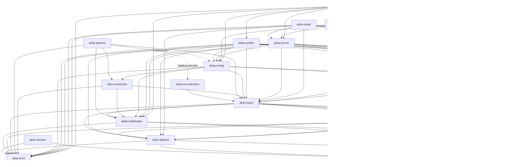

# Akita Crate Graph

Akita is split into small workspace crates so verifier-oriented consumers can
depend on public proof replay without pulling prover-only polynomial backends,
setup expansion, examples, or benchmark harnesses. This graph is derived from the
`crates/*/Cargo.toml` path dependencies; keep it in sync when edges change.
Narrative crate index: [`book/src/how/architecture.md`](../book/src/how/architecture.md).

There is **no** `akita-scheme` crate: the end-to-end `AkitaCommitmentScheme`
orchestration lives in `akita-pcs`.

## Crate index

| Crate | Role |
|-------|------|
| `akita-error` | Shared protocol error and reusable checked integer formulas |
| `jolt-field` (external) | Shared field traits, prime and extension fields, packed and unreduced kernels, parallel helpers |
| `akita-witness` | Shared `PolynomialView` / `WitnessProvider` vocabulary |
| `akita-serialization` | Serialization, validation, compression traits |
| `akita-algebra` | Modules, NTTs, cyclotomic rings, polynomials |
| `akita-transcript` | Fiat-Shamir transcript and descriptor preamble |
| `akita-challenges` | Challenge sampling helpers |
| `akita-sumcheck` | Sumcheck proofs, drivers, folding, batching |
| `akita-types` | Proof/setup/schedule/layout shapes, SIS floors, proof-size helpers |
| `akita-sis-estimator` | Offline scalar SIS attack-cost estimation and artifact certification |
| `akita-planner` | `Cfg`-free schedule search and optional preset-driven artifact emission |
| `akita-schedules` | Versioned artifacts, row audit, and validated owned catalogs |
| `akita-config` | Presets, `CommitmentConfig`, and artifact-family policy binding |
| `akita-setup` | Setup construction and optional cache |
| `akita-verifier` | Verifier replay (no prover polynomial backends) |
| `akita-prover` | Commitment, proving, witnesses, polynomial backends |
| `akita-metal` | Optional macOS compute backend with CPU fallback for unqualified shapes |
| `akita-pcs` | Umbrella orchestration, examples, integration tests |

## Dependency Layers

## Ownership Rules

- `akita-error` owns `AkitaError` and the reusable exact `usize` formulas in
  `akita_error::checked`. The formulas return `Option` and do not choose a
  protocol error variant. Callers map failure at the boundary where its meaning
  is known. Generic checked helpers must not be redefined in downstream crates.
- `akita-witness` owns the shared borrowed witness/polynomial view vocabulary
  (`PolynomialView`, `WitnessProvider`) consumed by sumcheck and polyops paths.
  It depends only on `akita-error` and external `jolt-field`. At the time of this graph,
  it is a workspace member without downstream `Cargo.toml` edges; cite it from
  the architecture chapter and polyops/sumcheck specs until prover/sumcheck
  depend on it explicitly.
- `akita-planner` is the offline schedule search and artifact emission engine.
  Normal planner search is `Cfg`-free and depends on `akita-types`,
  `akita-challenges`, `akita-error`, and `akita-schedules`. The optional
  `catalog-gen` feature also enables `akita-config`, allowing artifact-emission
  binaries to name concrete `CommitmentConfig` presets.
- `akita-sis-estimator` owns the offline scalar SIS cost model and table
  certification logic. It depends on inert schedule and matrix descriptions in
  `akita-types`. The planner's optional `catalog-security` feature uses it to
  report direct modeled costs for expanded artifact rows; normal planner,
  schedule, prover, and verifier builds do not depend on the estimator.
- `akita-schedules` owns canonical artifact encoding, bounded decoding, semantic
  row audit, and the immutable `ValidatedScheduleCatalog` indexes used at runtime.
  Tracked `.aks` family files are deterministic planner output but are never
  linked into the crate. It depends only on `akita-error`, `akita-types`, and
  `akita-challenges`.
- `akita-config` owns concrete runtime presets, the single `CommitmentConfig`
  policy trait, and the `TrustedScheduleCatalog<Cfg>` capability that binds a
  validated catalog to one exact preset. Applications load artifact bytes and
  pass the resulting bound catalog explicitly; configs do not own or resolve
  static rows.
- `akita-verifier` stays prover-free (no polynomial backends, no setup
  expansion) and is directly `<Cfg>`-generic. It receives the catalog explicitly
  and resolves only the statement's row digest. Verifier-reachable
  schedule resolution must reject malformed input with `AkitaError`, never panic
  (see [`docs/verifier-contract.md`](verifier-contract.md)).
- `akita-prover` owns polynomial backends, prover setup artifacts, NTT/matrix
  kernels, the explicit compute-backend operation traits, recursive and
  ring-switch witness construction, proving orchestration, and the
  Akita-specific sumcheck stage provers.
- `akita-types` owns inert shared protocol data: proof/setup/claim shapes,
  opening-point and layout math, schedule contracts, SIS sizing (`akita_types::sis`),
  and transcript append traits. It should not grow planner search or prover
  algorithms (offline search and compact emission machinery live in
  `akita-planner`).
- `akita-pcs` is the broad umbrella crate: it owns the end-to-end
  `AkitaCommitmentScheme` orchestration, re-exports the full public surface, and
  hosts examples and integration tests. Verifier-only integrations should not use
  it; prefer `akita-verifier` + `akita-types` + `akita-config`.

CI runs `scripts/check-crate-deps.sh` to guard the important one-way boundaries,
including that `akita-prover` and `akita-verifier` source does not name
`akita_planner::` paths directly. Runtime `akita-config` depends on
`akita-schedules`, not `akita-planner`; only the planner's optional catalog
generation path adds the reverse configuration dependency. Add new forbidden
edges there whenever a crate gets split further.
